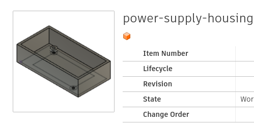
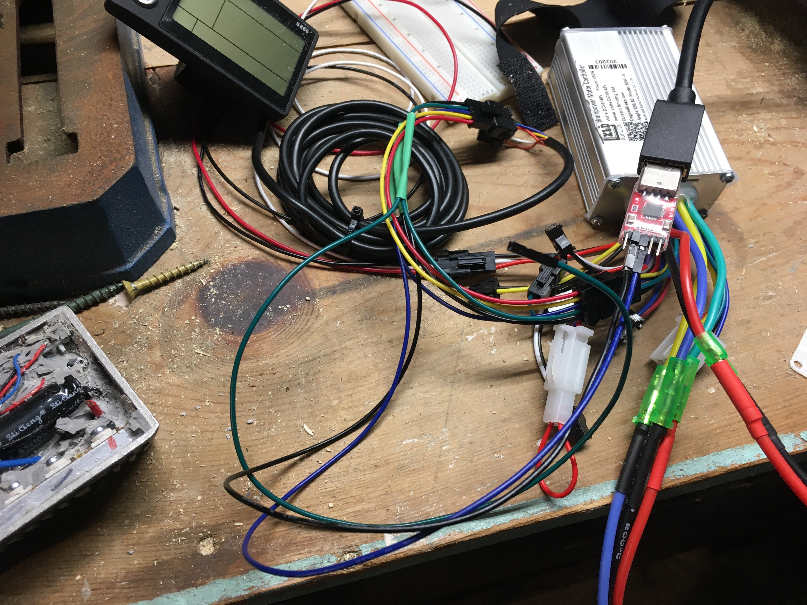

# lime-scooter

Lime Gen3 Scooter Hack
======================

I used a [Wemos D1 Mini clone for the microcontroller](https://www.amazon.com/gp/product/B081PX9YFV) and wrote [some Arduino code](./lime.ino) that drives the [display](https://www.buydisplay.com/1-69-inch-280x240-ips-tft-lcd-display-module-for-arduino-raspberry-pi) with a spedometer, odometer, and battery display. I also used [this display](https://www.amazon.com/gp/product/B07P9X3L7M) because it shipped faster.

The microcontroller needs a [5V power supply](https://www.amazon.com/gp/product/B06XRN7NFQ). I [expoxied](img/IMG_3039.jpg) the voltage adjusting screw. I'd like to try it without one, with a voltage divider instead. The MCU and screen draw about 25mV when sleeping and 125 when on. See https://youtube.com/shorts/8VgVIRs36Q8

I used [lead-free solder](https://www.amazon.com/gp/product/B003NTLQ6M) at 450 degrees. In the end, 525 worked better. My [iron](https://www.amazon.com/gp/product/B077JDGY1J). I thought I would burn out the MCU [soldering the pins on](img/IMG_2955.jpeg), but never did. 

Below is the schematic that connects the microcontroller to the [replacement speed controller](https://www.amazon.com/gp/product/B07TB7V7BJ) that I got on Amazon. I just threw away the one that came with the scooter. I spent some time digging it out of the cast iron casing it came in, thinking I'd mount my replacement there. It doesn't line up, so I just tossed it.

I used EasyEDA and made a cool [schematic](img/Schematic_lime-v01_2022-08-19.svg) and thought about getting the board manufactured. In the end I used [Fritzing](lime.v03.fzz). (I don't think I ended up using the 10k resitor, just the one resistor for the voltage divider on A0).

Here are photos of the proto board that make the circuit

I made a replacement [screen housing](https://a360.co/3pvFzx1), a microcontroller standoff, and a housing for the power supply in Fusion. Having [calipers](img/67320624998__4B6C731F-94F0-454F-99B1-646DE0FB5E3A.JPG) helped.

- [display](lime-display.f3z)
- [display housing](lime-display.stl)
- [ps housing](power-supply-housing.f3d)
- [ps housing](power-supply-housing.stl)
- [mcu standoff](MCU-standoff.stl)
- [mcu standoff](MCU-standoff.f3d)

I reversed-engineered the protocol between the motor controller and the display. [These are the C programs](diagnostics.zip) I used to figure it out. The display is the so-called S866. It's a standard [uart](https://en.wikipedia.org/wiki/Universal_asynchronous_receiver-transmitter). Here are some picture of the cable I made to do it. The cable is an extension between the 5-pin LCD on the motor controller and the LCD, with tap-in leads that you can use to peek on the voltage on any of the five lines, TX, RX, GND, 5V, or 36V. The trouble I had is that the MCU is 3.3V and the controller is 5V. So the controller's signal at 5V was overdriving the MCU and I had to take it down to 3.3V. I did it with a single pull-up transistor. I used this [uart](https://www.amazon.com/gp/product/B07D6LLX19) on my PC. A [scope](https://www.amazon.com/gp/product/B07QML4LJL), however cheap, was helpful.

This [post](https://www.pedelecforum.de/forum/index.php?threads/brainpower-motor-controller-250w-mit-s866-display-versuch-einer-funktionsanalyse.89310/#post-1850942) I found after having done all the work.

Here's a [tear down manual](https://kenpublic.s3.amazonaws.com/2022-08-20/2wd9-HrdW6-J9Rnj/lime-gen3-docs.pdf).

Here's a bunch of other stuff I used. A lot of the project was just making cables.

- [m4 screws for the bottom plate](https://www.amazon.com/gp/product/B01N4HPO2D)
- [connector for the motor](https://www.amazon.com/gp/product/B08LL8HPHR)
- [connectors for the motor](https://www.amazon.com/gp/product/B08GG7QX8J)

I can't remember if the 3.5 or 4mm ones fit. One of them did.

- [the lock](https://www.amazon.com/gp/product/B074LVGVTY)
- [replacement brake cable.](https://www.amazon.com/gp/product/B07H28S1ZM) Mine broke.
- [m6 replacement for one of the collar bolts](https://www.amazon.com/gp/product/B08YJJPKHT)
- [for the inserts to mount the display housing](https://www.amazon.com/gp/product/B09X2H5T86)
- [threaded inserts](https://www.amazon.com/gp/product/B08LQTD21D)
- https://www.amazon.com/gp/product/B08YYGRCBG
- https://www.amazon.com/gp/product/B08Z7FP236
- https://www.amazon.com/gp/product/B07TB8QXMC
- https://www.amazon.com/gp/product/B002AVVO7U

https://www.youtube.com/shorts/7AXKoABvEg4
https://www.youtube.com/shorts/jEweE6aFhZE

Some other pictures:

